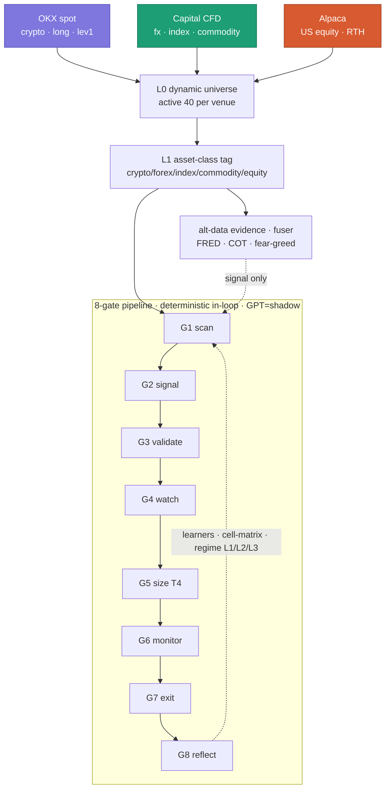

# Polaris v2 — System Architecture Map

> 전체 구조 한눈 지도. DEMO/PAPER · surgical-strike · aggressive bias. 2026-06-21 코드+라이브 검증.

## 연결 체인 (Jin "다 연결됨")
universe → **asset-class tag** → stream profile → regime(L1 macro / L2 asset-class / L3 ticker) → cell matrix → G1 ranker → sizing. asset-class가 load-bearing — 오태깅 시 전 체인 오염.

## 사이징 + 불변
T4: `base × scalar(0.75–1.5) × tier(1.5/2/3) × cell(1.5/0.5/1.0) → hard-MAX min()`. 불변: 9-stack 봉쇄 · hard-MAX ceiling · aggressive(방어 throttle/차단 X) · loss-defense=정밀 엑싯 · DEMO only.

## 현재 상태 (2026-06-21 검증)
- in-loop **AI-free** (W3 `aafb635`, in-loop GPT=0) — GPT는 shadow/sentinel observe-only
- Capital crypto 오염 = **이미 해결** (`460e416`+`dc3abda`, capital crypto=0, forex/index/commodity 정확 태깅)
- AI-conductor = P6 **out-of-loop 비동기** (W3와 양립) — 리서치 evidence는 fuser seam으로 흡수
- ⚠ latent: `_production_bars.py:412`(commodity/index→forex baseline 버킷), `_production_layers.py:395`(NULL JOIN→"crypto" fallback), `classify_regime` P0 stub

## 관련
[[ADR-003-8-layer-architecture]] · [[north-star]] · [[_NOW]] · [[ADR-005-sizing-formula-cell-routing]] · [[ADR-004-per-gate-ai-pipeline]]
